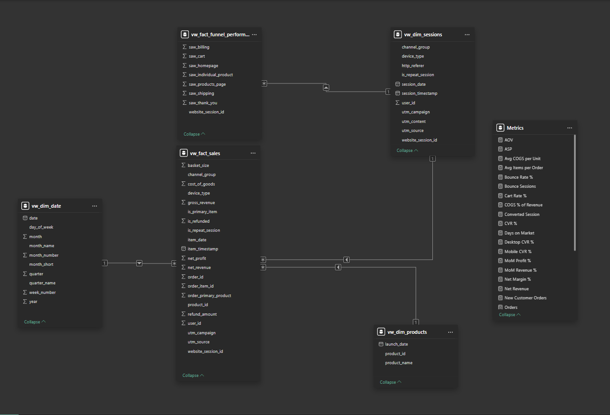
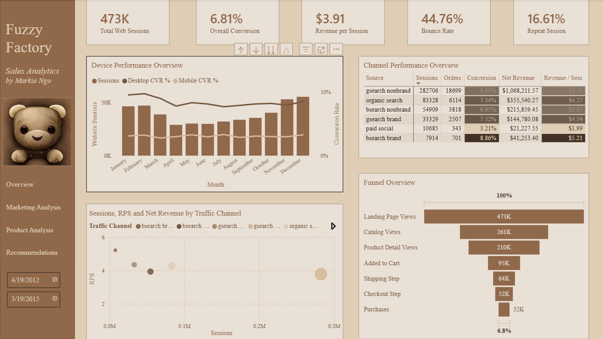
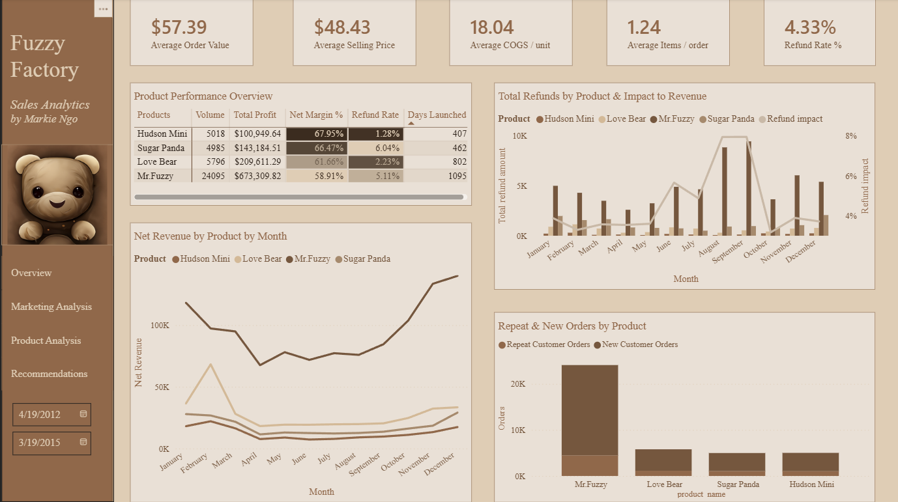

# Fuzzy Factory E-Commerce Analytics: Revenue, Funnel & Marketing Performance (2012-2015)
- Author: Markie Ngo **(Data Analyst)**
- Date: 02/2026
- Tool Used: **SQL Server**, **Power BI**, **Excel**
  - `SQL Server`: CTEs, Window Functions, Aggregations, Views, Data Validation
  - `Power BI`: DAX, Calculated Columns, Data Modeling, ETL, Data Visualization
  - `Excel`: Initial Data Exploration


# Table Of Contents (TOCS)
1. [Executive Summary](#executive-summary)
2. [Background & Objectives](#background--objectives)
3. [Dataset Description](#dataset-description)
4. [Data Modeling (Star Schema)](#data-modeling-star-schema)
5. [Data Processing & Metric Definitions (DAX)](#data-processing--metric-definitions-dax)
6. [Defining Key Questions before Data Visualization](#defining-key-questions-before-data-visualization)
7. [Key Insights & Visualization](#key-insights--visualization)
8. [Recommendations by Stakeholder](#recommendations-by-stakeholder)

# Executive Summary 
- This project develops a comprehensive Business Intelligence system for Fuzzy Factory, an e-commerce shop selling plush toys online.
- Using behavioral data from **480K+ web sessions** and **1M+ pageviews**, combined with transactional data from **32K+ orders**, the analysis helps business leaders:
  - Evaluate financial performance and profitability over time
  - Identify which marketing channels drive high-quality traffic and revenue
  - Diagnose conversion funnel drop-offs and optimize customer journey
  - Understand product-level profitability and refund risk
- The objective is to enable data-driven decisions on marketing spend allocation, funnel optimization, and product strategy to drive profitable growth.

# Background & Objectives
## Background: 
- Fuzzy Factory is growing its online business by investing heavily in digital marketing across multiple channels (paid search, organic, social, email).
- Leadership wants to ensure that growth is not just about traffic volume, but about efficient, profitable, and sustainable revenue generation.
- Understanding how visitors arrive, navigate the purchase funnel, and convert into paying customers is critical for optimizing marketing spend and operational efficiency.

## Four Core Requirements from Leadership:
1. Evaluate financial performance: revenue, profit, margin trends over time
2. Assess marketing channel efficiency: which sources drive high-quality traffic and revenue?
3. Diagnose conversion funnel performance: where are the biggest drop-offs?
4. Analyze product profitability: which products drive profit vs. refund risk?

# Dataset Description
## Data Source:
- Source: E-commerce behavioral and transactional data (sessions, pageviews, orders, order items, refunds, products)
- Size: 
  - **480K+ web sessions** across multiple marketing channels
  - **1M+ pageviews** tracking user navigation through the site
  - **32K+ completed orders** with detailed transaction records
  - **63K+ order line items** with pricing and cost information
- Format: CSV files
- Time Period: Multi-year operations (2012-2015)

## Data Tables:
| Table | Description | Grain |
|-------|-------------|-------|
| `website_sessions.csv` | Each row records a unique user session on the site, including device and traffic source | Session |
| `website_pageviews.csv` | All pageviews within each session, showing how users move through the funnel | Pageview |
| `orders.csv` | Completed orders with order-level detail (customer, timestamp, status) | Order |
| `order_items.csv` | Items within each order; contains price, cost and product information | Order item |
| `order_item_refunds.csv` | Refund transactions linked to order items | Refund transaction |
| `products.csv` | Product catalogue with names, categories and costs | Product |

## Data Relationships


# Data Modeling (Star Schema)

I followed the principles of **star schema**. This separates dimensions (descriptive attributes) from facts (numeric measures) and avoids fact-to-fact joins, ensuring scalable analysis.

## Dimensions

- **`dim_date`** – Calendar table for date hierarchies and time-based analysis (year, quarter, month, week, day)
- **`dim_products`** – Product attributes (product name, category, cost, price)
- **`dim_sessions`** – Bridge dimension capturing session attributes (device type, channel, landing page, UTM parameters)

## Facts

- **`fact_sales`** – Order-item grain with net revenue, cost, profit, and margin; handles refunds correctly at the transaction level
- **`fact_funnel_performance`** – Session grain with flags for each funnel step (landing page view, catalog view, product detail view, add to cart, shipping, checkout, purchase)

## Transformed Data Model 


# Data Processing & Metric Definitions (DAX)

## 1. Using SQL Server to:
> - **Data Cleaning**: Standardize data types, handle null values, detect anomalies in session/order data
> - **Channel Grouping**: Group marketing sources into meaningful channels (paid search brand, paid search non-brand, organic search, paid social, direct, email)
> - **Refund Aggregation**: Calculate net revenue by adjusting for refunds at the correct grain (order-item level)
> - **View Creation**: Build analytical views for each fact and dimension table
> - **Metric Validation**: Reconcile revenue, orders, and refunds between SQL layer and Power BI to ensure accuracy

## 2. Using Power BI to:
> - **ETL**: Import and transform data from SQL views
> - **DAX Calculations**: Create measures and calculated columns for KPIs
> - **Data Modeling**: Build relationships between fact and dimension tables
> - **Visualization**: Design multi-page dashboard for different stakeholder personas

## Key DAX Formulas

<details>
  <summary>Click to view examples of DAX formulas</summary>
  <br>

### Financial Metrics

**Net Margin %**: Profit as percentage of net revenue
```dax
Net Margin % = 
DIVIDE(
    [Profit],
    [Net Revenue],
    0
)
```

**Refund Rate %**: Percentage of orders that were refunded
```dax
Refund Rate % = 
DIVIDE(
    CALCULATE(COUNT(fact_sales[order_item_id]), fact_sales[refund_flag] = 1),
    COUNT(fact_sales[order_item_id]),
    0
)
```

### Order & Customer Metrics

**Average Order Value (AOV)**: Average revenue per order
```dax
AOV = 
DIVIDE(
    [Net Revenue],
    [Total Orders],
    0
)
```

**Average Selling Price (ASP)**: Average price per item sold
```dax
ASP = 
DIVIDE(
    [Net Revenue],
    COUNT(fact_sales[order_item_id]),
    0
)
```

### Marketing & Funnel Metrics

**Conversion Rate (CVR)**: Percentage of sessions that result in purchase
```dax
CVR = 
DIVIDE(
    [Total Orders],
    [Total Sessions],
    0
)
```

**Revenue per Session (RPS)**: Average revenue generated per session
```dax
RPS = 
DIVIDE(
    [Net Revenue],
    [Total Sessions],
    0
)
```

**Funnel Step Conversion Rates**:
```dax
Landing to Catalog % = 
DIVIDE(
    CALCULATE(COUNTROWS(fact_funnel), fact_funnel[viewed_catalog] = 1),
    [Total Sessions],
    0
)

Catalog to Product % = 
DIVIDE(
    CALCULATE(COUNTROWS(fact_funnel), fact_funnel[viewed_product] = 1),
    CALCULATE(COUNTROWS(fact_funnel), fact_funnel[viewed_catalog] = 1),
    0
)

Product to Cart % = 
DIVIDE(
    CALCULATE(COUNTROWS(fact_funnel), fact_funnel[added_to_cart] = 1),
    CALCULATE(COUNTROWS(fact_funnel), fact_funnel[viewed_product] = 1),
    0
)
```

### Product Metrics`

**Product Margin %**: Margin percentage by product
```dax
Product Margin % = 
DIVIDE(
    [Product Profit],
    CALCULATE([Net Revenue]),
    0
)
```

**Product Refund Rate**: Refund rate by product
```dax
Product Refund Rate = 
DIVIDE(
    CALCULATE(COUNT(fact_sales[order_item_id]), fact_sales[refund_flag] = 1),
    COUNT(fact_sales[order_item_id]),
    0
)
```

</details>

> All DAX measure definitions are documented in `/docs/dax_measures.md`. The dashboard reconciles these measures back to the SQL layer to ensure data accuracy and trust.
> 

# Defining Key Questions before Data Visualization

## Step 1: Identify Business Problems

### Financial Performance
- What are the revenue, profit, and margin trends over time?
- Which months/quarters drive the highest profitability?
- What is the impact of refunds on net revenue?

### Marketing Efficiency
- Which marketing channels generate the most sessions and revenue?
- Which channels have the highest conversion rates and revenue per session?
- Where should we allocate or cut marketing budget?

### Conversion Funnel
- Where are the biggest drop-offs in the purchase funnel?
- How does funnel performance differ by device (desktop vs. mobile)?
- Which pages or steps need the most optimization?

### Product Performance
- Which products drive the most profit vs. which have the highest refund risk?
- What is the product mix and concentration of revenue?
- How can we improve items per order and average order value?

## Step 2: Map Questions to Data & Metrics

| Business Question | Data Source | Key Metrics |
|-------------------|-------------|-------------|
| Financial health? | fact_sales, dim_date | Gross Revenue, Net Revenue, Profit, Margin %, AOV |
| Channel efficiency? | fact_funnel, dim_sessions | Sessions, CVR, RPS by channel |
| Funnel drop-offs? | fact_funnel | Step-by-step conversion rates, absolute counts |
| Product profitability? | fact_sales, dim_products | Units sold, profit, margin %, refund rate by product |
| Device impact? | fact_funnel, dim_sessions | CVR, sessions by device type |

# Key Insights & Visualization

## I. Executive Overview: Financial Performance


### Key Findings:

1. **Business Performance**:
    - Gross revenue: **$1.93M** | Net revenue: **$1.85M** | Profit: **$1.13M**
    - Net margin: **61.03%** across **32,182 orders**
    - Refund drag: **$77K** (4.33% refund rate)

2. **Order Economics**:
    - AOV: **$57.39** | ASP: **$48.43** | Items/order: **1.24**
    
    => **Low basket size (1.24 items/order) = untapped cross-sell opportunity**

3. **Growth Trends**:
    - Consistent MoM revenue growth with stable profitability
    - COGS % declining over time (improving unit economics)
    
    => **Healthy margins provide runway for growth investment**

## II. Marketing & Funnel Performance: Channel Efficiency


### Key Findings:

1. **Channel Efficiency**:
    
    | Channel | Sessions | Net Revenue | CVR | RPS |
    |---------|----------|-------------|-----|-----|
    | gsearch nonbrand | 282,706 | $1,068,211 | 6.42% | $3.78 |
    | bsearch brand | 36,854 | $192,058 | 8.86% | $5.21 |
    | paid social | 10,688 | $21,227 | 3.21% | $1.99 |
    
    => **Brand search = highest efficiency. Nonbrand = growth engine. Social = underperforming (fix or cut).**

2. **Traffic Quality vs. Volume**:
    - High-volume channels (nonbrand search) can still be efficient if conversion rates are healthy
    - Brand search converts nearly 3x better than social despite being paid traffic
    - Direct and organic channels show strong engagement and conversion

    => **Marketing budget should prioritize channels with high RPS (brand search, organic) while continuing to scale proven performers (nonbrand search).**

3. **Conversion Funnel Analysis**:
    - Total sessions: **473,000**
    - Overall conversion rate: **6.81%**
    
    **Funnel step-by-step breakdown**:
    - Landing Page → Catalog: **261K** (55% of sessions reach catalog)
    - Catalog → Product Detail: **210K** (80% progression)
    - Product Detail → Cart: **95K** (45% progression) **← LARGEST DROP-OFF**
    - Cart → Shipping: **64K** (67% progression)
    - Shipping → Checkout: **52K** (81% progression)
    - Checkout → Purchase: **32K** (62% progression) **← SECOND LARGEST DROP-OFF**

    => **Two critical optimization opportunities: (1) Product Detail to Cart - need stronger CTAs, clearer value props, trust signals. (2) Checkout to Purchase - reduce form friction, offer guest checkout, simplify payment flow.**

4. **Device Performance Gap**:
    - Desktop carries majority of sessions
    - Mobile conversion rates are persistently lower than desktop across all months
    - Mobile represents untapped revenue opportunity from existing traffic

    => **Mobile experience needs targeted improvements: faster load times, mobile-first checkout, simplified forms, sticky CTAs.**
   
5. **Landing Page Performance**:
    - 55% of sessions reach the catalog page
    - 45% bounce or exit before viewing products
    - Landing page effectiveness varies significantly by channel

    => **Optimize landing page relevance by channel. Ensure paid search ads align with landing page messaging. Test different landing page variations for high-bounce channels.**

6. **Product Detail Page (PDP) Optimization**:
    - Only 45% of product viewers add to cart (biggest drop-off point)
    - Clear opportunity for improvement through:
      - Stronger calls-to-action
      - More prominent pricing and shipping information
      - Enhanced product images and descriptions
      - Trust signals (reviews, guarantees, badges)
      - Visibility of stock levels and urgency cues

    => **PDP improvements represent the highest-leverage conversion opportunity. A/B test CTA placement, product copy, and image quality.**

7. **Checkout Abandonment**:
    - 38% of users abandon at checkout (second biggest drop-off)
    - Common reasons likely include:
      - Form complexity (too many required fields)
      - Unexpected costs (shipping, taxes)
      - Lack of guest checkout option
      - Payment security concerns

    => **Simplify checkout flow: reduce required fields, show all costs upfront, enable guest checkout, add payment security badges, improve error messaging.**

## III. Product Analysis: Profitability & Refund Risk


### Key Findings:

1. **Product Economics**:
    
    | Product | Units | Profit | Margin | Refund Rate |
    |---------|-------|--------|--------|-------------|
    | Mr. Fuzzy | 24,095 | $673,309 | 58.91% | 5.11% |
    | Hudson Mini | 5,018 | — | 67.95% | 1.28% |
    | Sugar Panda | — | — | 66.47% | 6.04% |
    
    => **Mr. Fuzzy = volume leader but quality risk. Hudson Mini = best economics (high margin, low refunds). Sugar Panda = margin threatened by refunds.**

2. **Portfolio Risk**:
    - Revenue concentrated in Mr. Fuzzy (over-reliance on single SKU)
    - Refund rates vary 1.28% to 6.04% by product
    - Items/order: **1.24** (minimal bundling)
    
    => **Track refunds weekly by product. Grow Hudson Mini (safer profit). Build bundles to lift basket size.**

3. **Cross-Sell & Bundle Opportunity**:
    - Items per order: **1.24** (very low)
    - Most orders contain only one product
    - Limited evidence of successful bundling or upselling

    => **Introduce product bundles at cart and product detail page. Implement "frequently bought together" recommendations. Create starter packs or themed sets to increase basket size.**

4. **Product Mix Strategy**:
    - High-volume/low-margin (Mr. Fuzzy) vs. Low-volume/high-margin (Hudson Mini)
    - Over-reliance on single SKU for profitability is risky
    - Opportunity to grow safer, higher-margin products

    => **Strategically grow Hudson Mini through featured placement, landing page tests, and bundle inclusion. Balance portfolio risk by reducing dependence on single product.**


# Recommendations by Stakeholder

| **Who** | **Strategy** | **Insight** | **Recommendation** |
| ------- | ------------ | ----------- | ------------------ |
| **CEO / General Manager** | **Grow profitably while keeping acquisition efficiency and product quality in check** | Business is highly profitable overall: $1.93M gross revenue, $1.13M profit, 61.03% net margin, 32,182 orders. Strong foundation but refunds and conversion leaks are limiting growth. | Keep scaling proven channels (search + core product) but prioritize fixing conversion leaks (PDP, checkout) and reducing refunds because these are the biggest "multipliers" on profit at current margin. |
| **Marketing Lead** | **Allocate budget to channels that maximize Revenue per Session (RPS), not just traffic volume** | **bsearch brand** is highest efficiency: CVR 8.86%, RPS $5.21. **gsearch nonbrand** is the growth engine: 282,706 sessions, $1,068,211 net revenue (largest volume + revenue). **Paid social** is weak: CVR 3.21%, RPS $1.99, $21,227 net revenue (worst efficiency). | **Protect/expand brand search coverage**: increase budget caps, monitor impression share, defend against competitors. **Keep scaling nonbrand search** but optimize for intent: keyword pruning, landing page relevance, negative keywords. **Fix or cut paid social**: tighten targeting + creative + landing page alignment; if RPS doesn't improve after testing, reallocate budget to search/SEO. |
| **Growth / Conversion (Web UX)** | **Improve conversion by attacking the biggest funnel drop-offs (highest impact)** | Funnel math shows two critical leaks: **Product Detail → Cart** (45% conversion, largest leak) and **Checkout → Purchase** (62% conversion, second biggest leak). Overall CVR is 6.81%; fixing these steps could push CVR to 10%+. | **Prioritize Product Detail → Cart**: stronger CTA placement, clearer value propositions, shipping/returns visibility upfront, remove friction (surprise costs), add trust cues (reviews, security badges), improve product photos/descriptions. **Prioritize Checkout → Purchase**: reduce form friction, enable guest checkout, fewer required fields, clearer error states, multiple payment options (PayPal, Apple Pay). Use channel/device cuts to A/B test: fix pages where high-volume channels leak most (especially nonbrand traffic). |
| **Mobile Experience Owner** | **Close the desktop-mobile conversion gap to unlock "free" revenue from existing traffic** | Desktop carries most sessions; mobile conversion is visibly lower across all months (persistent gap in dashboard). Mobile users abandoning at higher rates, especially on product pages and checkout. | **Mobile-first checkout fixes**: autofill for forms, fewer required fields, sticky CTA button, faster page load times. **Mobile product detail improvements**: above-the-fold CTA, compress images without quality loss, simplify copy for smaller screens, clearer price + shipping display. **Report a simple KPI**: Mobile CVR vs Desktop CVR gap, track monthly to measure progress. |
| **Product / Merchandising** | **Balance "profit per product" with "quality risk" (refunds) and portfolio dependence** | **Mr. Fuzzy** dominates: 24,095 units, $673,309 profit (largest by far) but lowest margin (58.91%) and elevated refund rate (5.11%). **Hudson Mini** has highest-quality economics: 67.95% margin, 1.28% refund rate but low volume (5,018 units). **Sugar Panda** has quality flag: 6.04% refund rate (highest) despite strong margin (66.47%). Overall: AOV $57.39, ASP $48.43, Items/order 1.24 (limited bundling/upsell). | **Reduce refund drivers on Sugar Panda + Mr. Fuzzy**: tighten product expectations (improve copy/images/sizing info), strengthen QA checks, upgrade packaging, add post-purchase guidance (care instructions). **Grow Hudson Mini intentionally** (it's "safe profit"): featured placement on homepage, include in bundles, create "starter offer" with discount. **Lift items per order (1.24)** via bundles/add-ons at cart and product page to raise AOV without needing more traffic. Create themed sets (e.g., "Trio Pack", "Gift Set"). |
| **Finance / Operations** | **Protect margin while scaling volume** | Strong margin headroom (61% net margin) + measurable refund drag (4.33% refund rate overall). Visible refund spikes by month in dashboard. COGS % trending down over time, indicating improving unit economics as scale increases. | **Track refunds as weekly ops metric by product** (especially Sugar Panda / Mr. Fuzzy) and tie refund rate to product page changes and supplier/QA actions. Create refund "early warning system" if weekly rate exceeds threshold. **Keep watching COGS efficiency over time** (dashboard shows COGS % trending down) and ensure continued scale doesn't reverse gains. Negotiate supplier pricing as volume grows. **Monitor refund reasons** (if captured) to identify systemic issues: wrong size, damaged in shipping, doesn't match photos, etc. |


# Project Structure

```
fuzzy-factory-analytics/
├── csv/
│   ├── website_sessions.csv
│   ├── website_pageviews.csv
│   ├── orders.csv
│   ├── order_items.csv
│   ├── order_item_refunds.csv
│   └── products.csv
├── sql/
│   ├── Schema DDL final.sql
│   ├── Views (newest).sql
│   ├── Data Validation.sql
│   └── Exploratory Data Analysis.sql
├── powerbi/
│   └── fuzzy_factory_dashboard.pbix
├── assets/
│   ├── star_schema_before.png
│   ├── star_schema_after.png
│   ├── dashboard_page1.png
│   ├── dashboard_page2.png
│   ├── dashboard_page3.png
│   └── dashboard_page4.png
├── docs/
│   └── dax_measures.md
└── README.md
```

# Key Takeaways
The project: 
- Identified $800K+ annual opportunity from fixing two funnel drop-offs (PDP and checkout)
- Recommended channel reallocation that could improve marketing ROI by 20-30%
- Highlighted product quality issues causing $77K in annual refund losses
