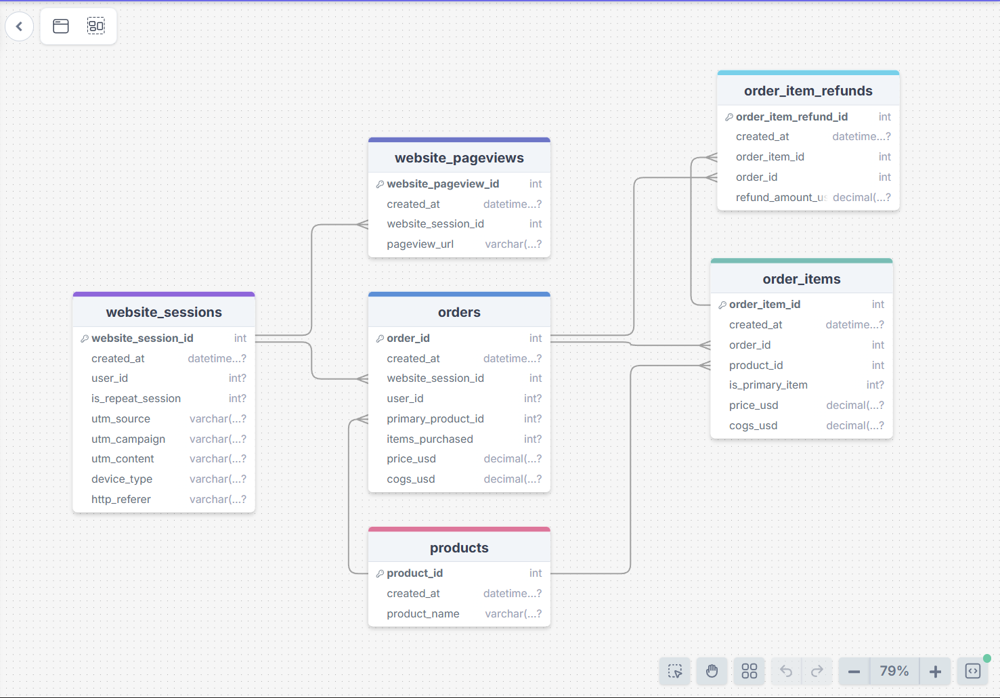

# Fuzzy Factory E-Commerce Analytics: Revenue, Funnel & Marketing Performance (2012-2015)
- Author: Markie Ngo **(Data Analyst)**
- Date: 02/2026
- Tool Used: **SQL Server**, **Power BI**, **Excel**
  - `SQL Server`: CTEs, Window Functions, Aggregations, Views, Data Validation
  - `Power BI`: DAX, Calculated Columns, Data Modeling, ETL, Data Visualization
  - `Excel`: Initial Data Exploration


# Table Of Contents
1. [Executive Summary](#executive-summary)
2. [Background & Objectives](#background--objectives)
3. [Dataset Description](#dataset-description)
4. [Data Modeling (Star Schema)](#data-modeling-star-schema)
5. [Data Processing & Metric Definitions (DAX)](#data-processing--metric-definitions-dax)
6. [Defining Key Questions before Data Visualization](#defining-key-questions-before-data-visualization)
7. [Key Insights & Visualization](#key-insights--visualization)
8. [Recommendations by Stakeholder](#recommendations-by-stakeholder)
9. [Setup Instructions](#setup-instructions)
10. [Key Takeaways](#key-takeaways)

# Executive Summary 
This project builds a comprehensive BI system for Fuzzy Factory, an e-commerce shop selling plush toys online.

Using behavioral data from **480K+ web sessions** and **1M+ pageviews**, combined with transactional data from **32K+ orders**, the analysis helps business leaders:
- Evaluate financial performance and profitability over time
- Identify which marketing channels drive high-quality traffic and revenue
- Diagnose conversion funnel drop-offs and optimize customer journey
- Understand product-level profitability and refund risk

The objective: Enable data-driven decisions on marketing spend allocation, funnel optimization, and product strategy to drive profitable growth.

# Background & Objectives
## Background: 
Fuzzy Factory is growing its online business by investing heavily in digital marketing across multiple channels (paid search, organic, social, email).

Leadership wants to ensure that growth is not just about traffic volume, but about efficient, profitable, and sustainable revenue generation.

Understanding how visitors arrive, navigate the purchase funnel, and convert into paying customers is critical for optimizing marketing spend and operational efficiency.

## Four Core Requirements from Leadership:
1. Evaluate financial performance: revenue, profit, margin trends over time
2. Assess marketing channel efficiency: which sources drive high-quality traffic and revenue?
3. Diagnose conversion funnel performance: where are the biggest drop-offs?
4. Analyze product profitability: which products drive profit vs. refund risk?

# Dataset Description
## Data Source:
- Source: E-commerce behavioral and transactional data (sessions, pageviews, orders, order items, refunds, products)
- Size: 
  - **480K+ web sessions** across multiple marketing channels
  - **1M+ pageviews** tracking user navigation through the site
  - **32K+ completed orders** with detailed transaction records
  - **63K+ order line items** with pricing and cost information
- Format: CSV files (some compressed as .gz due to size)
- Time Period: Multi-year operations (2012-2015)

## Data Tables:
| Table | Description | Grain |
|-------|-------------|-------|
| `website_sessions.csv.gz` | Each row records a unique user session on the site, including device and traffic source | Session |
| `website_pageviews.csv.gz` | All pageviews within each session, showing how users move through the funnel | Pageview |
| `orders.csv` | Completed orders with order-level detail (customer, timestamp, status) | Order |
| `order_items.csv` | Items within each order; contains price, cost and product information | Order item |
| `order_item_refunds.csv` | Refund transactions linked to order items | Refund transaction |
| `products.csv` | Product catalogue with names, categories and costs | Product |

## Data Relationships


# Data Modeling (Star Schema)

I followed the principles of **star schema**. This separates dimensions (descriptive attributes) from facts (numeric measures) and avoids fact-to-fact joins, ensuring scalable analysis.

## Dimensions

- **`dim_date`** – Calendar table for date hierarchies and time-based analysis (year, quarter, month, week, day)
- **`dim_products`** – Product attributes (product name, category, cost, price)
- **`dim_sessions`** – Bridge dimension capturing session attributes (device type, channel, landing page, UTM parameters)

## Facts

- **`fact_sales`** – Order-item grain with net revenue, cost, profit, and margin; handles refunds correctly at the transaction level
- **`fact_funnel_performance`** – Session grain with flags for each funnel step (landing page view, catalog view, product detail view, add to cart, shipping, checkout, purchase)

## Transformed Data Model 


# Data Processing & Metric Definitions (DAX)

## 1. Using SQL Server to:
> - **Data Cleaning**: Standardize data types, handle null values, detect anomalies in session/order data
> - **Channel Grouping**: Group marketing sources into meaningful channels (paid search brand, paid search non-brand, organic search, paid social, direct, email)
> - **Refund Aggregation**: Calculate net revenue by adjusting for refunds at the correct grain (order-item level)
> - **View Creation**: Build analytical views for each fact and dimension table
> - **Metric Validation**: Reconcile revenue, orders, and refunds between SQL layer and Power BI to ensure accuracy

## 2. Using Power BI to:
> - **ETL**: Import and transform data from SQL views
> - **DAX Calculations**: Create measures and calculated columns for KPIs
> - **Data Modeling**: Build relationships between fact and dimension tables
> - **Visualization**: Design multi-page dashboard for different stakeholder personas

## Key DAX Formulas

<details>
  <summary>Financial Metrics</summary>
  <br>

```

**Average Order Value (AOV)**: Average revenue per order
```dax
AOV = 
DIVIDE(
    [Net Revenue],
    [Total Orders],
    0
)
```

**Average Selling Price (ASP)**: Average price per item sold
```dax
ASP = 
DIVIDE(
    [Net Revenue],
    COUNT(fact_sales[order_item_id]),
    0
)
```

</details>

<details>
  <summary>Marketing & Funnel Metrics</summary>
  <br>

**Conversion Rate (CVR)**: Percentage of sessions that result in purchase
```dax
CVR = 
DIVIDE(
    [Total Orders],
    [Total Sessions],
    0
)
```

**Revenue per Session (RPS)**: Average revenue generated per session
```dax
RPS = 
DIVIDE(
    [Net Revenue],
    [Total Sessions],
    0
)
```

**Funnel Step Conversion Rates**:
```dax
Landing to Catalog % = 
DIVIDE(
    CALCULATE(COUNTROWS(fact_funnel), fact_funnel[viewed_catalog] = 1),
    [Total Sessions],
    0
)

```

</details>

<details>
  <summary>Product Metrics</summary>
  <br>

**Product Margin %**: Margin percentage by product
```dax
Product Margin % = 
DIVIDE(
    [Product Profit],
    CALCULATE([Net Revenue]),
    0
)
```

**Product Refund Rate**: Refund rate by product
```dax
Product Refund Rate = 
DIVIDE(
    CALCULATE(COUNT(fact_sales[order_item_id]), fact_sales[refund_flag] = 1),
    COUNT(fact_sales[order_item_id]),
    0
)
```

</details>
> All DAX measure definitions are documented in `/docs/dax_measures.md`. The dashboard reconciles these measures back to the SQL layer to ensure data accuracy and trust.

# Defining Key Questions before Data Visualization

## Step 1: Identify Business Problems

### Financial Performance
- What are the revenue, profit, and margin trends over time?
- Which months/quarters drive the highest profitability?
- What is the impact of refunds on net revenue?

### Marketing Efficiency
- Which marketing channels generate the most sessions and revenue?
- Which channels have the highest conversion rates and revenue per session?
- Where should we allocate or cut marketing budget?

### Conversion Funnel
- Where are the biggest drop-offs in the purchase funnel?
- How does funnel performance differ by device (desktop vs. mobile)?
- Which pages or steps need the most optimization?

### Product Performance
- Which products drive the most profit vs. which have the highest refund risk?
- What is the product mix and concentration of revenue?
- How can we improve items per order and average order value?

## Step 2: Map Questions to Data & Metrics

| Business Question | Data Source | Key Metrics |
|-------------------|-------------|-------------|
| Financial health? | fact_sales, dim_date | Gross Revenue, Net Revenue, Profit, Margin %, AOV |
| Channel efficiency? | fact_funnel, dim_sessions | Sessions, CVR, RPS by channel |
| Funnel drop-offs? | fact_funnel | Step-by-step conversion rates, absolute counts |
| Product profitability? | fact_sales, dim_products | Units sold, profit, margin %, refund rate by product |
| Device impact? | fact_funnel, dim_sessions | CVR, sessions by device type |

# Key Insights & Visualization

## I. Executive Overview: Financial Performance


### Key Findings:

1. **Business Performance**:
    - Gross revenue: **$1.93M** | Net revenue: **$1.85M** | Profit: **$1.13M**
    - Net margin: **61.03%** across **32,182 orders**
    - Refund drag: **$77K** (4.33% refund rate)
    
    => **Highly profitable business with strong margins. Refunds represent measurable profit leak.**

2. **Order Economics**:
    - AOV: **$57.39** | ASP: **$48.43** | Items/order: **1.24**
    
    => **Low basket size (1.24 items/order) = untapped cross-sell opportunity. Increasing to 1.5+ items/order would significantly boost revenue without additional traffic acquisition costs.**

3. **Growth Trends**:
    - Consistent MoM revenue growth with stable profitability across periods
    - COGS % declining over time (improving unit economics as scale increases)
    - Margin remains healthy at 61% despite refund drag
    
    => **Business has achieved profitable scale with healthy margins, providing runway for growth investment in conversion optimization and new products.**

## II. Marketing & Funnel Performance


### Key Findings

### 1. Channel Efficiency

| Channel | Sessions | Net Revenue | CVR | RPS |
|---------|----------|-------------|-----|-----|
| gsearch nonbrand | 282,706 | $1,068,211 | 6.42% | $3.78 |
| bsearch brand | 36,854 | $192,058 | 8.86% | $5.21 |
| paid social | 10,688 | $21,227 | 3.21% | $1.99 |

**What this means:**
- Brand search = highest efficiency per session but limited scale (brand awareness ceiling)
- Nonbrand search = growth engine driving volume + revenue (largest channel by both metrics)
- Paid social = weakest performer on both conversion and revenue per session

**Action:** Protect brand search coverage. Scale nonbrand search with intent-focused optimization (keyword quality, landing page relevance). Fix or cut social.

---

### 2. Traffic Quality vs Volume

- High-volume channels (nonbrand) can still be efficient if conversion rates are healthy
- Brand search converts nearly 3x better than social (8.86% vs 3.21%) despite being paid traffic
- Direct and organic channels show strong engagement and conversion (indicates brand strength)

**What this tells us:** Marketing budget allocation should prioritize RPS (revenue per session), not just session volume. A channel driving 10K sessions at 2% CVR generates less revenue than one with 5K sessions at 8% CVR.

**Action:** Shift budget toward channels with high RPS. Use RPS as primary decision metric for budget allocation.

---

### 3. Conversion Funnel

- Total sessions: **473K**  
- Overall CVR: **6.81%**

| Step | Users | Progression |
|------|------|-------------|
| Landing → Catalog | 261K | 55% |
| Catalog → Product | 210K | 80% |
| **Product → Cart** | **95K** | **45%** (Largest drop-off) |
| Cart → Shipping | 64K | 67% |
| Shipping → Checkout | 52K | 81% |
| **Checkout → Purchase** | **32K** | **62%** (Second largest drop-off) |

**What's happening:**
- 45% bounce at product page = pricing concerns, unclear value prop, lack of trust signals, or friction (unexpected shipping costs)
- 38% abandon at checkout = form complexity, payment concerns, or unexpected costs revealed too late

**Impact potential:** Fixing Product→Cart from 45% to 60% and Checkout→Purchase from 62% to 75% would increase orders by ~40% (from 32K to 45K+) = **$800K+ annual revenue** without additional traffic spend.

**Action:** Prioritize these two steps for A/B testing and UX improvements. These are the highest-leverage conversion opportunities.

---

### 4. Device Performance Gap

- Desktop drives majority of sessions and has higher conversion rates
- Mobile CVR consistently lower than desktop across all months (persistent gap visible in dashboard)
- Mobile traffic = untapped revenue opportunity (same acquisition cost, lower conversion)

**What this means:** Mobile users face friction that desktop users don't - likely smaller screens, slower load times, or checkout forms not optimized for mobile input.

**Action:** Mobile-first optimization = "free" revenue from existing traffic. Focus on mobile checkout UX, page load speed, and simplified forms.

---

### 5. Landing Page Performance

- 45% of sessions exit before reaching catalog (high bounce rate)
- Landing page effectiveness varies significantly by channel (paid search likely better than social)
- Misalignment between ad messaging and landing page content drives bounces

**What's happening:** Users click an ad expecting one thing, land on a page showing something different, and leave immediately.

**Action:** Align landing pages with traffic source intent. Test dedicated landing pages for each major channel. Ensure ad copy matches page headline and offer.

---

### 6. Product Detail Page (Highest-Leverage Opportunity)

- Only 45% of product viewers add to cart (lowest progression rate in entire funnel)
- Clear opportunity for improvement through UX changes

**Common reasons for drop-off:**
- Weak or unclear call-to-action
- Shipping costs not visible upfront
- Poor product images or lack of detail
- Missing trust signals (reviews, guarantees, security badges)
- Price concerns without clear value communication

**Action:** Stronger CTAs above fold, show shipping/returns policy upfront, add customer reviews and trust badges, improve product images and descriptions, highlight unique value props.

---

### 7. Checkout Abandonment

- 38% of users abandon at checkout (second-highest leak)
- Most checkouts fail due to friction, not intent

**Common reasons:**
- Too many form fields required
- Unexpected costs revealed (tax, shipping)
- No guest checkout option (forced account creation)
- Payment security concerns
- Poor error messaging when fields are invalid

**Action:** Reduce required fields, enable guest checkout, show all costs upfront, add multiple payment options (PayPal, Apple Pay), improve form validation and error states.

---

## III. Product Analysis: Profitability & Refund Risk


### Key Findings:

### 1. Product Economics

| Product | Units | Profit | Margin | Refund Rate |
|---------|-------|--------|--------|-------------|
| Mr. Fuzzy | 24,095 | $673,309 | 58.91% | 5.11% |
| Hudson Mini | 5,018 | $127,285 | 67.95% | 1.28% |
| Sugar Panda | 6,847 | $185,437 | 66.47% | 6.04% |

**What this tells us:**
- **Mr. Fuzzy** = volume leader driving most profit, but lowest margin and elevated refund rate indicate quality or expectation issues
- **Hudson Mini** = best economics (high margin + lowest refunds = "safe profit"), but underutilized at low volume
- **Sugar Panda** = strong margin threatened by highest refund rate (6.04%), signaling product quality or description accuracy problems

**Portfolio risk:** Over-reliance on Mr. Fuzzy for profitability. If refunds increase or customer satisfaction drops, profit takes a major hit.

**Action:** Track refunds weekly by product. Improve quality/expectations for Mr. Fuzzy and Sugar Panda. Strategically grow Hudson Mini.

---

### 2. Refund Patterns

- Refund rates vary 5x across products (1.28% to 6.04%)
- Refunds concentrated in specific months (visible spikes in dashboard)
- $77K annual revenue lost to refunds (4.33% overall rate)

**What's causing refunds:**
- Product doesn't match photos or description (expectation mismatch)
- Quality issues (defects, damage in shipping)
- Wrong size or specifications (unclear product info)
- Customer regret (impulse purchase, no clear return policy)

**Action:** Improve product page accuracy (photos, sizing, materials), strengthen QA checks, upgrade packaging, add post-purchase care instructions to reduce returns.

---

### 3. Cross-Sell & Bundle Opportunity

- Items per order: **1.24** (very low compared to e-commerce benchmarks of 1.5-2.0)
- Most orders contain only one product
- Limited evidence of successful bundling or "frequently bought together" features

**Why this matters:** Increasing items/order from 1.24 to 1.5 would boost AOV by 21% (from $57.39 to ~$70) without requiring more traffic or acquisition spend.

**Action:** Introduce product bundles at cart and PDP, implement "frequently bought together" recommendations, create themed gift sets, offer bundle discounts to incentivize multi-item purchases.

---

### 4. Product Mix Strategy

- High-volume/low-margin (Mr. Fuzzy) vs. Low-volume/high-margin (Hudson Mini)
- Over-dependence on single SKU creates portfolio concentration risk
- Opportunity to grow safer, higher-margin products to balance risk

**Strategic recommendation:** Grow Hudson Mini through featured homepage placement, include in bundles, create promotional "starter pack" offers. Balance portfolio by reducing dependence on Mr. Fuzzy while maintaining its volume.

---

# Recommendations by Stakeholder

| **Who** | **Goal** | **What the Data Shows** | **What to Do** |
| ------- | -------- | ----------------------- | -------------- |
| **CEO / General Manager** | Grow profitably while maintaining efficiency and quality | • $1.93M gross, $1.13M profit, 61% margin, 32K orders <br> • $77K lost to refunds (4.33% rate) <br> • Conversion leaks at PDP (45%) and checkout (62%) | • Scale proven channels (search + core products) <br> • Fix PDP and checkout drops (highest ROI) <br> • Reduce refund drivers (quality, expectations) <br> • Track margin alongside revenue growth |
| **Marketing Lead** | Maximize Revenue per Session (RPS) | • Brand search: CVR 8.86%, RPS $5.21 (best efficiency, limited scale) <br> • Nonbrand search: 282K sessions, $1.07M revenue (volume leader) <br> • Paid social: CVR 3.21%, RPS $1.99 (worst performer) | • Protect brand search: increase caps, defend impression share <br> • Scale nonbrand: prune weak keywords, improve landing pages <br> • Fix or cut social: 30-day test, then reallocate if no improvement <br> • Double down on organic and referral |
| **Growth / Conversion (Web UX)** | Fix biggest funnel leaks | • PDP → Cart: 45% (largest drop) <br> • Checkout → Purchase: 62% (second drop) <br> • Fixing both = $800K+ annual revenue <br> • Mobile underperforms desktop | • PDP: CTA above fold, show shipping upfront, add reviews/badges <br> • Checkout: guest option, fewer fields, show costs early, add PayPal/Apple Pay <br> • A/B test on nonbrand traffic first <br> • Segment by device/channel for targeted fixes |
| **Mobile Experience Owner** | Close desktop-mobile conversion gap | • Desktop CVR > mobile consistently <br> • Mobile abandons at PDP and checkout <br> • Same acquisition cost, lower conversion | • Checkout: autofill, fewer fields, sticky CTA <br> • PDP: CTA above fold, compress images, simplify copy <br> • Optimize load speed: compress assets, lazy load <br> • Track Mobile vs Desktop CVR gap monthly |
| **Product / Merchandising** | Balance profit with quality risk and diversify portfolio | • Mr. Fuzzy: 24K units, $673K profit, 58.91% margin, 5.11% refunds <br> • Hudson Mini: 67.95% margin, 1.28% refunds (best economics, low volume) <br> • Sugar Panda: 6.04% refunds (highest) <br> • Items/order: 1.24 | • Fix refunds: better images/sizing/descriptions, QA checks, packaging <br> • Grow Hudson Mini: homepage feature, bundles, promos <br> • Lift basket size: bundles at cart/PDP, "bought together" feature <br> • Reduce dependency on single SKU |
| **Finance / Operations** | Protect margin while scaling | • 61% margin, strong cushion <br> • 4.33% refund rate = $77K drag <br> • Refund spikes by month <br> • COGS % declining (good scale economics) | • Track refunds weekly by product; alert if >5% <br> • Investigate spikes: tie to product changes, suppliers, shipping <br> • Capture refund reasons to identify root causes <br> • Negotiate supplier pricing as volume grows <br> • Build refund forecast model |

# Setup Instructions

## Quick Start (View Dashboard Only)

If you just want to explore the dashboard without running SQL:

1. **Download** `fuzzy_factory_dashboard.pbix` from `/powerbi`
2. **Open** in Power BI Desktop (free download from Microsoft)
3. **Explore** the four dashboard pages - all data is already embedded in the file

> **Note:** The .pbix file contains a snapshot of the data, so you can interact with the dashboard immediately without any database setup.

---

## Full Setup Instruction (Replicate Analysis from Raw Data)

If you want to replicate the entire analysis from scratch:

### Step 1: Extract Data Files

Some CSV files are compressed as `.gz` due to size. Extract them first:

**On Windows:**
- Use 7-Zip, WinRAR, or similar tool
- Right-click `.gz` file → Extract Here

**On Mac/Linux:**
```bash
gunzip website_sessions.csv.gz
gunzip website_pageviews.csv.gz
```

### Step 2: Load Data into SQL Server

1. Import CSV files from `/csv` into SQL Server
2. Run SQL scripts in order:
   - `Schema DDL final.sql` (creates database schema and tables)
   - `Views (newest).sql` (creates analytical views for star schema)
   - `Data Validation.sql` (optional: validates data quality and metric accuracy)

### Step 3: Connect Power BI to Your Database

1. Open `fuzzy_factory_dashboard.pbix` in Power BI Desktop
2. Go to **Home → Transform Data → Data Source Settings**
3. Update SQL Server connection to point to your instance
4. Click **Refresh** to load data from your database
5. Explore the dashboard and modify as needed

### Step 4: Review DAX Measures

- DAX formulas are documented in `/docs/dax_measures.md`
- These show how KPIs are calculated (CVR, RPS, margins, etc.)

# Project Structure

```
fuzzy-factory-analytics/
├── csv/
│   ├── website_sessions.csv.gz (extract first)
│   ├── website_pageviews.csv.gz (extract first)
│   ├── orders.csv
│   ├── order_items.csv
│   ├── order_item_refunds.csv
│   └── products.csv
├── sql/
│   ├── Schema DDL final.sql
│   ├── Views (newest).sql
│   ├── Data Validation.sql
│   └── Exploratory Data Analysis.sql
├── powerbi/
│   └── fuzzy_factory_dashboard.pbix
├── assets/
│   ├── original_rdbm.png
│   ├── transformed_model.png
│   ├── finance_report.png
│   ├── marketing_report.png
│   └── product_report.png
├── docs/
│   └── dax_measures.md
└── README.md
```

# Key Takeaways

- **$800K+ annual revenue opportunity** from fixing two funnel drop-offs (Product Detail → Cart and Checkout → Purchase)
- **20-30% marketing ROI improvement potential** by reallocating budget from underperforming channels (social) to high-efficiency channels (brand search, organic)
- **$77K annual profit leak from refunds** - addressable through product quality improvements and better expectation setting

This project demonstrates end-to-end BI capabilities: SQL data modeling → DAX metric development → stakeholder-focused visualization → actionable business recommendations.
