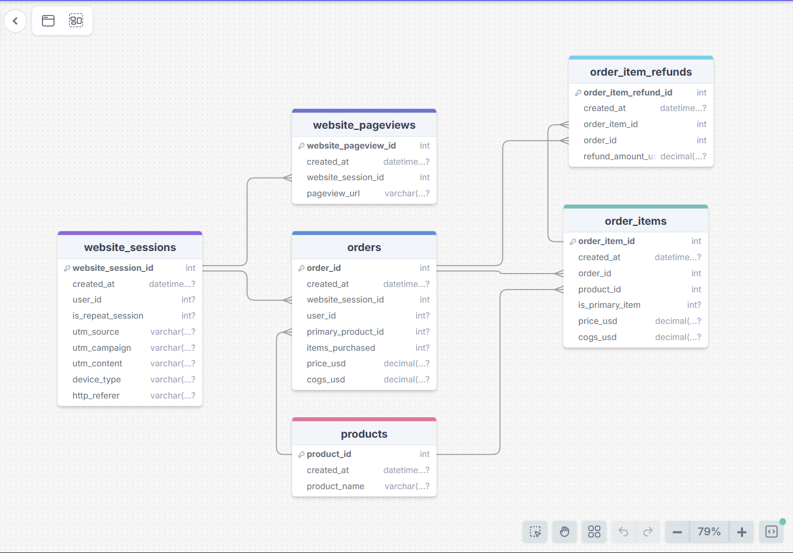
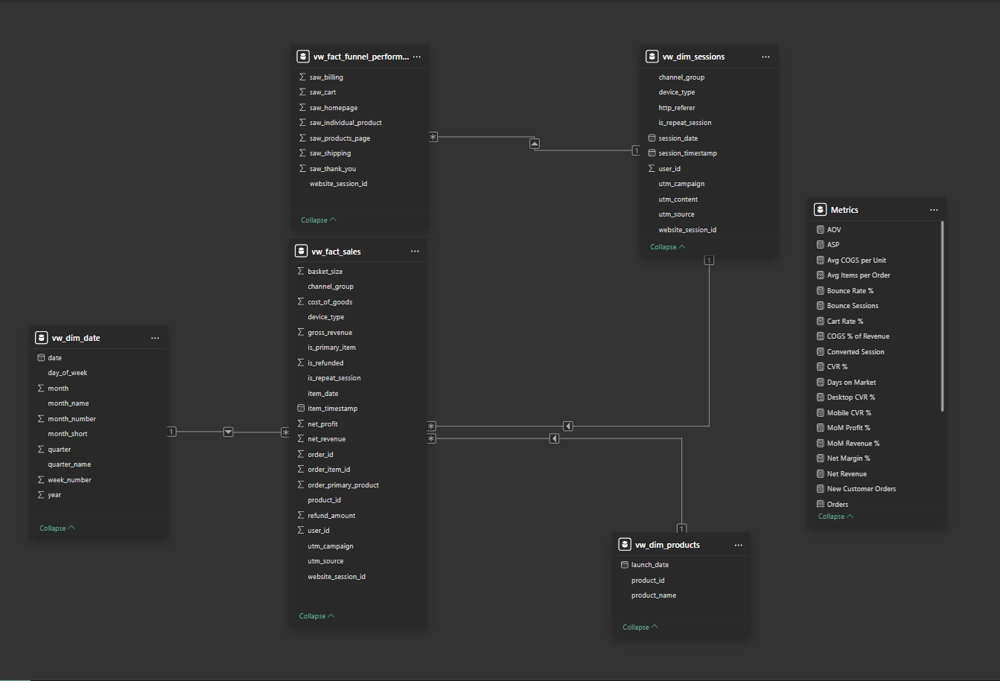

# Fuzzy Factory — E-Commerce Analytics (2012–2015)

**Author:** Markie Ngo · **Role:** Data Analyst · **Date:** Feb 2026

<p align="center">
  
  
  
</p>

> End-to-end BI system for Fuzzy Factory, an e-commerce plush toy retailer. Raw session and transaction data → SQL star schema → Power BI dashboard across four years of operations.

**Full analysis and recommendations → [REPORT.md](REPORT.md)**

---

## 📋 Contents

1. [What This Answers](#-what-this-answers)
2. [Dataset](#-dataset)
3. [Data Model](#-data-model)
4. [DAX Measures](#-dax-measures)
5. [Setup](#-setup)
6. [Project Structure](#-project-structure)

---

## 🎯 What This Answers

| # | Business Question |
|---|------------------|
| 1 | How is the business performing — revenue, profit, and margin over time? |
| 2 | Which marketing channels are worth the spend? |
| 3 | Where in the purchase funnel are we losing customers? |
| 4 | Which products make money and which carry the most risk? |

---

## 📁 Dataset

| Table | Contents | Grain |
|-------|----------|-------|
| `website_sessions.csv.gz` | Sessions with device type, UTM source, and campaign | Session |
| `website_pageviews.csv.gz` | Every page URL hit within each session | Pageview |
| `orders.csv` | Completed orders with revenue and COGS | Order |
| `order_items.csv` | Line items per order with price and cost | Order item |
| `order_item_refunds.csv` | Refund transactions linked to order items | Refund |
| `products.csv` | 4-product catalog with launch dates | Product |

> **Scale:** 480K+ sessions · 1M+ pageviews · 32K+ orders · 4 products · 2012–2015

---

## 🗂️ Data Model

Star schema with two fact tables and three dimension tables.

<details>
<summary><strong>Original RDBMS Schema</strong></summary>
<br>



</details>

<details>
<summary><strong>Transformed Star Schema (Power BI)</strong></summary>
<br>



</details>

### Facts

| Table | Grain | Key Columns |
|-------|-------|-------------|
| `fact_sales` | Order item | gross revenue, COGS, refunds, net profit |
| `fact_funnel_performance` | Session | binary flags per funnel step |

### Dimensions

| Table | Contains |
|-------|----------|
| `dim_date` | Year, quarter, month, week, day |
| `dim_products` | Product name, launch date |
| `dim_sessions` | Device type, channel group, UTM parameters |

---

## 📐 DAX Measures

<details>
<summary><strong>💰 Financial</strong></summary>
<br>

```dax
Gross Revenue = SUM(fact_sales[gross_revenue])

Net Revenue = SUM(fact_sales[net_revenue])

Profit = SUM(fact_sales[net_profit])

Net Margin % = DIVIDE([Profit], [Net Revenue], 0)

Refund Rate % =
DIVIDE(
    CALCULATE(COUNT(fact_sales[order_item_id]), fact_sales[is_refunded] = 1),
    COUNT(fact_sales[order_item_id]),
    0
)

AOV = DIVIDE([Net Revenue], [Total Orders], 0)

ASP = DIVIDE([Net Revenue], COUNT(fact_sales[order_item_id]), 0)
```

</details>

<details>
<summary><strong>📣 Marketing & Funnel</strong></summary>
<br>

```dax
Total Sessions = DISTINCTCOUNT(fact_funnel[website_session_id])

CVR = DIVIDE([Total Orders], [Total Sessions], 0)

RPS = DIVIDE([Net Revenue], [Total Sessions], 0)

Landing to Catalog % =
DIVIDE(
    CALCULATE(COUNTROWS(fact_funnel), fact_funnel[saw_products_page] = 1),
    [Total Sessions], 0
)

Catalog to Product % =
DIVIDE(
    CALCULATE(COUNTROWS(fact_funnel), fact_funnel[saw_individual_product] = 1),
    CALCULATE(COUNTROWS(fact_funnel), fact_funnel[saw_products_page] = 1),
    0
)

Product to Cart % =
DIVIDE(
    CALCULATE(COUNTROWS(fact_funnel), fact_funnel[saw_cart] = 1),
    CALCULATE(COUNTROWS(fact_funnel), fact_funnel[saw_individual_product] = 1),
    0
)

Cart to Shipping % =
DIVIDE(
    CALCULATE(COUNTROWS(fact_funnel), fact_funnel[saw_shipping] = 1),
    CALCULATE(COUNTROWS(fact_funnel), fact_funnel[saw_cart] = 1),
    0
)

Shipping to Checkout % =
DIVIDE(
    CALCULATE(COUNTROWS(fact_funnel), fact_funnel[saw_billing] = 1),
    CALCULATE(COUNTROWS(fact_funnel), fact_funnel[saw_shipping] = 1),
    0
)

Checkout to Purchase % =
DIVIDE(
    CALCULATE(COUNTROWS(fact_funnel), fact_funnel[saw_thank_you] = 1),
    CALCULATE(COUNTROWS(fact_funnel), fact_funnel[saw_billing] = 1),
    0
)
```

</details>

<details>
<summary><strong>📦 Product</strong></summary>
<br>

```dax
Units Sold = COUNT(fact_sales[order_item_id])

Product Margin % = DIVIDE([Profit], [Net Revenue], 0)

Product Refund Rate =
DIVIDE(
    CALCULATE(COUNT(fact_sales[order_item_id]), fact_sales[is_refunded] = 1),
    COUNT(fact_sales[order_item_id]),
    0
)
```

</details>

---

## ⚙️ Setup

### View Dashboard Only

> Download `fuzzy_factory_dashboard.pbix` from `/powerbi` and open in Power BI Desktop. All data is embedded — no database setup needed.

---

### Replicate from Raw Data

**Step 1 — Extract compressed files**

```bash
# Mac/Linux
gunzip csv/website_sessions.csv.gz
gunzip csv/website_pageviews.csv.gz
```

On Windows: right-click → Extract with 7-Zip or WinRAR.

**Step 2 — Load into SQL Server**

Run scripts in this order:

| Script | Purpose |
|--------|---------|
| `sql/ddl.sql` | Creates tables and indexes |
| `sql/views.sql` | Builds star schema views |
| `sql/data_validation.sql` | *(Optional)* Data quality checks |
| `sql/exploratory_da.sql` | *(Optional)* EDA queries |

**Step 3 — Connect Power BI**

1. Open `fuzzy_factory_dashboard.pbix`
2. **Home → Transform Data → Data Source Settings**
3. Update server name → **Refresh**

---

## 📂 Project Structure

```
fuzzyfactory/
├── csv/
│   ├── website_sessions.csv.gz
│   ├── website_pageviews.csv.gz
│   ├── orders.csv
│   ├── order_items.csv
│   ├── order_item_refunds.csv
│   └── products.csv
├── sql/
│   ├── ddl.sql
│   ├── views.sql
│   ├── data_validation.sql
│   └── exploratory_da.sql
├── powerbi/
│   └── fuzzy_factory_dashboard.pbix
├── assets/
│   ├── original_rdbm.png
│   ├── transformed_model.png
│   ├── finance_report.png
│   ├── marketing_report.png
│   └── product_report.png
├── docs/
│   └── dax.md
├── REPORT.md
└── README.md
```
