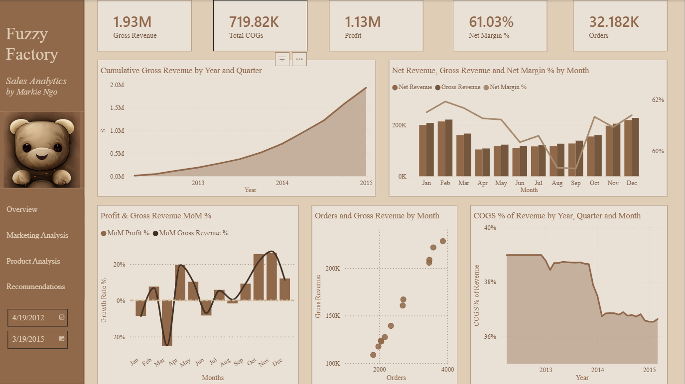
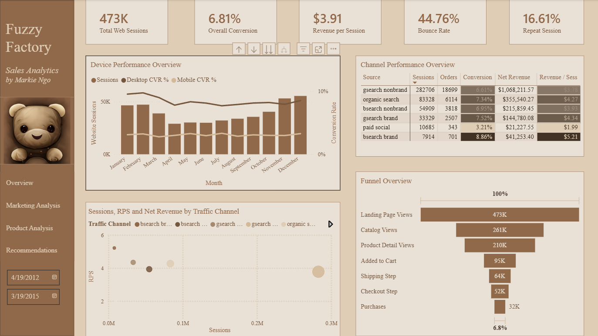
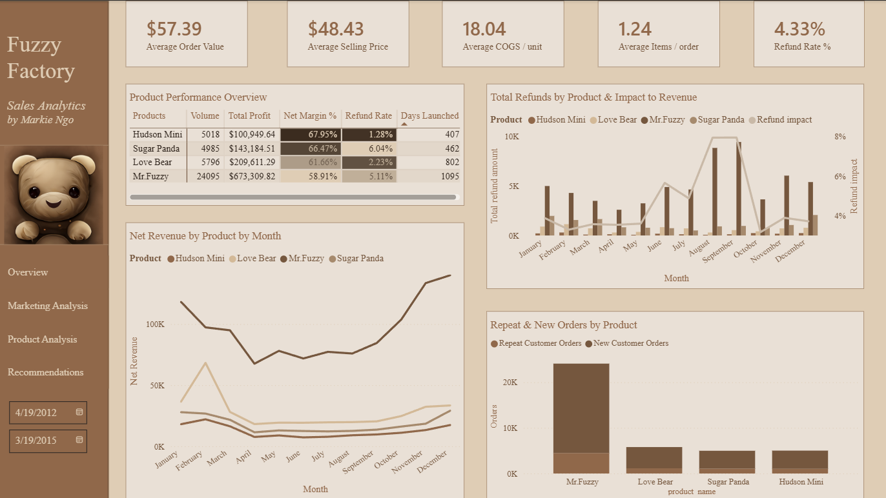

# Fuzzy Factory — Business Analysis Report (2012–2015)

> **$1.93M** gross revenue · **61%** net margin · **32K** orders · **4** products · **4** years

**Jump to:** [Financial](#-i-financial-performance) · [Marketing](#-ii-marketing--channel-performance) · [Funnel](#-iii-conversion-funnel) · [Products](#-iv-product-performance) · [Recommendations](#-recommendations) · [Bottom Line](#-bottom-line)

---

## 🎯 Questions We Set Out to Answer

<strong>Financial Performance</strong>

 

- What are revenue, profit, and margin trends over time?
- Which periods drive the most profitability?
- How much are refunds actually costing us?

<strong>Marketing Efficiency</strong>

 

- Which channels generate quality traffic, not just volume?
- Where should budget be shifted?
- What does revenue per session look like across channels?

<strong>Conversion Funnel</strong>

 

- Where are users dropping off?
- How does device type affect conversion?
- Which steps have the highest leverage for improvement?

<strong>Product Performance</strong>

 

- Which products drive profit?
- Which carry the most refund risk?
- Is cross-sell working?

---

## 💰 I. Financial Performance

### Headline Numbers

| Metric | Value |
|--------|-------|
| Gross Revenue | $1,930,000 |
| Net Revenue | $1,850,000 |
| **Profit** | **$1,130,000** |
| **Net Margin** | **61.03%** |
| Total Orders | 32,182 |
| Refund Drag | $77,000 (4.33%) |
| AOV | $57.39 |
| ASP | $48.43 |
| Items per Order | 1.24 |

---

### Findings

> **📈 Margins are strong and improving.** 61% net margin is healthy for e-commerce. COGS as a % of revenue has been declining — unit economics improving as volume scales. The business has earned the right to invest in growth.

> **⚠️ Refunds are a $77K hole — but it's addressable.** At 4.33% overall it's not alarming, but it's concentrated in specific products and months. That means identifiable causes, not systemic ones.

> **💡 Basket size is the biggest untapped lever.** 1.24 items/order vs. an e-commerce benchmark of 1.5–2.0. Getting to 1.5 lifts AOV from $57 to ~$70 — a **22% revenue increase with zero additional traffic spend**. This is a product and UX problem, not a demand problem.

---

## 📣 II. Marketing & Channel Performance

### Channel Breakdown

| Channel | Sessions | Net Revenue | CVR | RPS |
|---------|----------|-------------|-----|-----|
| gsearch nonbrand | 282,706 | $1,068,211 | 6.42% | $3.78 |
| bsearch brand | 36,854 | $192,058 | 8.86% | $5.21 |
| paid social | 10,688 | $21,227 | 3.21% | $1.99 |

---

### Findings

**1. Channel Efficiency**

> **✅ Brand search is the most efficient channel** — 8.86% CVR and $5.21 RPS, nearly 3x social. The ceiling is brand awareness: you can't scale it like nonbrand.

> **📈 Nonbrand search is the growth engine** — most volume, most absolute revenue, 6.42% CVR. This is the channel to invest in: more budget, better keywords, tighter landing page alignment.

> **⚠️ Paid social is underperforming on every metric** — 3.21% CVR and $1.99 RPS. It's not just low; it's 45% below the next worst channel. Give it a structured 30-day test (new creative, dedicated landing page, refined audience), then cut it if RPS doesn't move.

---

**2. Traffic Quality vs. Volume**

Volume metrics alone are misleading. A channel with 10K sessions at 2% CVR generates less revenue than one with 5K sessions at 8% CVR.

> **💡 RPS (Revenue per Session) is the right primary metric for budget allocation** — it captures both conversion rate and order value in a single number.

Direct and organic channels show strong CVR and RPS with zero paid spend — a signal of brand strength. Unlike paid channels, these compound over time.

**Budget reallocation priority:**

| Priority | Channel | Action |
|----------|---------|--------|
| 1 | Brand search | Protect caps, defend impression share |
| 2 | Nonbrand search | Prune weak keywords, improve landing pages |
| 3 | Organic & direct | Invest in SEO, content, email |
| 4 | Paid social | 30-day structured test → cut if no improvement |

---

## 🔍 III. Conversion Funnel

### Overall: 473K sessions → 32K orders = **6.81% CVR**

| Funnel Step | Users | Rate | Status |
|-------------|-------|------|--------|
| Landing Page | 473K | — | |
| → Catalog | 261K | 55% | |
| → Product Page | 210K | 80% | |
| **→ Cart** | **95K** | **45%** | 🔴 Largest drop |
| → Shipping | 64K | 67% | |
| → Checkout | 52K | 81% | |
| **→ Purchase** | **32K** | **62%** | 🟠 Second drop |

---

### Findings

**1. Landing Page → Catalog (55%)**

45% of sessions exit before seeing any products. For paid channels this is costly — you're paying for traffic that leaves immediately.

> **💡 This is almost always a message-match problem.** Ad copy promises one thing, landing page delivers another, user leaves. Most visible in social and nonbrand campaigns where intent is lower.

<strong>What to fix</strong>

 

- Audit top landing pages by channel — ensure ad headlines match page headlines
- Test dedicated landing pages per campaign instead of sending all traffic to the homepage
- Align offer and visual language between ad and landing page

---

**2. Product Page → Cart (45%) — Highest-Leverage Opportunity**

> **🔴 The biggest leak in the entire funnel.** Below benchmark for e-commerce (55–65%), and it affects every single user who reaches a product page.

<strong>Why users look at a product but don't add to cart</strong>

 

- Price shock with no visible shipping cost (they're calculating the real total in their head)
- Weak or buried CTA — below the fold on mobile
- No trust signals: no reviews, no guarantees, no return policy visible
- Product images that don't build confidence
- Unclear product details (sizing, materials, what's included)

<strong>What to fix</strong>

 

- CTA above the fold, especially on mobile
- Show total price including shipping upfront
- Add customer reviews and a visible return/exchange policy
- Improve product images (multiple angles, size reference, lifestyle context)
- Test "gift-ready" messaging — these are plush toys, gifting is a primary use case

---

**3. Checkout → Purchase (62%) — Second Largest Drop**

> **🟠 38% of people who start checkout don't finish.** These users have high intent — they added to cart, entered shipping info. Something stops them at the payment step.

<strong>Why users abandon at checkout</strong>

 

- Forced account creation before purchase
- Unexpected costs appearing for the first time (tax, shipping revealed late)
- Too many required form fields
- Limited payment options (no PayPal, no Apple Pay)
- Payment security concerns — no trust badges visible
- Poor error handling — invalid field, confusing message, user gives up

<strong>What to fix</strong>

 

- Enable guest checkout
- Show all costs (shipping + tax) before the payment screen
- Reduce required form fields to the minimum
- Add PayPal and Apple Pay
- Add security badges at the payment step
- Improve inline form validation and error messages

---

**4. Device Performance Gap**

> **⚠️ Mobile CVR is consistently below desktop across every month in the dataset.** Same acquisition cost, lower yield — this is free revenue being left on the table.

Mobile users face compounding friction: smaller screens, slower load times, checkout forms not designed for touch input.

<strong>What to fix</strong>

 

- Checkout: autofill support, sticky CTA button, fewer required fields
- PDP: compress images for faster load, simplify copy, CTA above fold
- Track mobile vs. desktop CVR gap as a standalone monthly KPI

---

> **💰 The math on fixing the two biggest drops:** Lifting Product→Cart from 45% → 60% and Checkout→Purchase from 62% → 75% pushes orders from 32K to ~45K. That's roughly **$800K+ in additional annual revenue from existing traffic. No ad spend required.**

---

## 📦 IV. Product Performance

### Product Economics

| Product | Launched | Units Sold | Profit | Margin | Refund Rate |
|---------|----------|-----------|--------|--------|-------------|
| Mr. Fuzzy | Mar 2012 | 24,095 | $673,309 | 58.91% | 5.11% |
| Love Bear | Jan 2013 | — | — | — | — |
| Sugar Panda | Dec 2013 | 6,847 | $185,437 | 66.47% | 6.04% |
| Hudson Mini | Feb 2014 | 5,018 | $127,285 | 67.95% | 1.28% |

---

### Findings

**1. Product-Level Breakdown**

> **⚠️ Mr. Fuzzy carries the business — and that's the risk.** Drives most units and most absolute profit, but lowest margin and elevated refunds. It's also been on the market since 2012 — most exposed to commoditization. If quality slips or competition increases, there's no buffer.

> **✅ Hudson Mini has the best unit economics.** Highest margin (67.95%) and lowest refund rate (1.28%) — a 4x difference from Sugar Panda. It's underutilized. No prominent homepage placement, no bundle positioning, no promotional push. Growing it reduces concentration risk and improves overall portfolio margin.

> **🔴 Sugar Panda's refund rate needs investigation.** 6.04% is the highest in the portfolio. Most likely cause: expectation mismatch — product images or descriptions don't match what customers receive. Pull refund reason data and check whether complaints cluster around a specific issue.

---

**2. Refund Patterns**

$77K across the period. Rates vary **5x across products** (1.28% to 6.04%). Monthly spikes are visible in the dashboard — refunds aren't evenly distributed, they track specific events (product launches, promotions, supplier changes, shipping carrier issues).

<strong>Common refund drivers</strong>

 

- Product doesn't match photos or description (most common)
- Defects or damage in shipping
- Wrong size or specifications due to unclear product info
- Customer regret with no easy exchange path

<strong>What to fix</strong>

 

- Improve product page accuracy (multi-angle photos, size reference objects, material descriptions)
- Strengthen QA checks on outbound orders
- Upgrade packaging for fragile items
- Add post-purchase care instructions
- Set a weekly refund rate alert threshold at **5% per product**
- When monthly spikes occur, trace to product batch, supplier, or shipping carrier

---

**3. Cross-Sell Gap**

> **💡 1.24 items per order means most customers are buying exactly one product.** No evidence of bundle recommendations, "frequently bought together" features, or cart-level upsells working. Plush toys are natural bundles — gift sets, character collections, themed packs. The demand is there. The merchandising isn't.

<strong>What to fix</strong>

 

- Add bundle recommendations at cart and product detail page
- Implement "frequently bought together" (Mr. Fuzzy + Hudson Mini is an obvious pairing)
- Create themed gift sets for key seasons
- Offer a small bundle discount to incentivize multi-item orders
- Getting from 1.24 → 1.5 items/order = **+22% AOV** with no additional acquisition spend

---

**4. Portfolio Concentration Risk**

> **⚠️ One SKU from 2012 generates the majority of profit.** The portfolio is imbalanced: high-volume/lower-margin (Mr. Fuzzy) vs. high-margin/low-volume products that aren't being promoted. Deliberate rebalancing — featuring and bundling newer products — reduces risk while improving overall portfolio margin.

---

## ✅ Recommendations

| Who | What the data shows | What to do |
|-----|--------------------|-----------| 
| **CEO** | $1.13M profit, 61% margin, two major funnel leaks, $77K refund drag, portfolio concentrated in one SKU | Fix PDP and checkout first — highest ROI, no ad spend. Track margin alongside revenue growth. Deliberately grow Hudson Mini to reduce single-SKU dependency. |
| **Marketing** | Brand search CVR 8.86% / RPS $5.21. Nonbrand drives most volume. Social CVR 3.21% / RPS $1.99 — worst on both. | Protect brand search caps. Scale nonbrand with better keyword selection and landing pages. Give social a structured 30-day test, then cut if RPS doesn't move. Invest in organic and direct. |
| **Growth / UX** | PDP→Cart at 45% (largest drop). Checkout→Purchase at 62% (second). Combined fix = ~$800K from existing traffic. | PDP: CTA above fold, show shipping upfront, add reviews and trust badges, improve images. Checkout: guest option, fewer fields, show costs before payment, add PayPal/Apple Pay. A/B test on nonbrand traffic first. |
| **Mobile** | Mobile CVR below desktop every month. Same acquisition cost, lower conversion. | Autofill at checkout, sticky CTA on PDP, compress images, simplify copy. Track mobile vs. desktop CVR gap monthly. |
| **Product / Merch** | Hudson Mini: best economics, lowest volume. Sugar Panda: highest refunds. Basket size 1.24. | Feature Hudson Mini on homepage and in bundles. Audit Sugar Panda product page for expectation mismatches. Add bundle recommendations at cart and PDP. |
| **Finance / Ops** | $77K refunds, visible monthly spikes, 5x variance across products. COGS % declining. | Monitor refund rate by product weekly. Alert at >5%. Trace spikes to batch, supplier, or carrier. Capture refund reasons at point of return. |

---

## 🏁 Bottom Line

> **Three numbers that define the opportunity:**
>
> - **$800K+** — revenue gain from fixing Product→Cart and Checkout→Purchase, with zero additional traffic spend
> - **$77K** — annual profit lost to refunds, concentrated in two products, addressable through page accuracy and QA
> - **22%** — AOV increase from lifting basket size to 1.5 items/order through bundles and cross-sell
>
> The business has strong margins and a working acquisition engine. The growth isn't in spending more on traffic — **it's in converting the traffic that's already there.**
